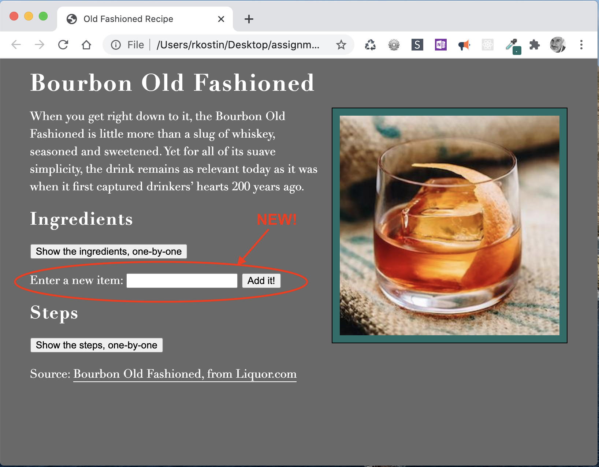

# Assignment 4: HTML Forms & jQuery

*Due: Thursday, September 17, 2020 (extra time!)* 

Your assignment is to take your Assignment 3 files and add an HTML form that uses jQuery to allow users to add items to one of your existing lists, fashioned after the demonstration shown in the last lecture.

The main purpose of this assignment is to demonstrate how to use both HTML forms and jQuery to  manipulate the DOM of a webpage.

## Steps


1. Make a copy of your Assignment 3.  Call it **Assignment 4**.
   - If you're using GitHub, this would be a "branch" (not required for this assignment)
2. Edit your **HTML file** and install jQuery in the appropriate place
   - You can either incorporate jQuery into your file system or use a CDN
3. In your HTML file, add an **HTML form** that appears like the following, below (in the red circle), positioned directly below one of your lists
   - For this assignment, you only need to install the **Add Item widget** on *one* of your lists
   - You can change the words and/or layout but you need to maintain the intent of the widget; feel free to target the form and its elements with new CSS (optional)
   - Requirements, in the HTML code:
     - In the FORM element you need to use the POST method and a blank action attribute
     - Around your label text, you must use the LABEL tag with a correctly coded FOR attribute
     - For the actual input field, you must use an INPUT tag with the type="" attribute set to TEXT; you will also need an id="" attribute
     - You must use another INPUT tag (not a button) with the type="" attribute set to SUBMIT; you can use a value="" attribute to change the text of the submit button (optional), and you will also need an id="" attribute



4. In your **scripts.js** file, under the JavaScript you wrote previously, fulfill the following requirements using jQuery
   - When the user enters text in the input field and clicks the submit button, the user's text is appended to the end of the existing list, wrapped in a LI tag
   - After the user enters text and clicks the submit button, the text in the input field disappears
   - If the user clicks the submit button but does not enter any text in the input field, nothing happens
   - Use JavaScript comments in the **scripts.js** file to indicate you understand what everything does; be verbose!

*Note: for this assignment, there is no persistant data. Refreshing the web page resets the webpage and wipes previously entered input.*

## Hints & Tips

*My original plan was to have us work on this assignment during a live workshop.  In lieu of that, here are some hints and tips.  Good luck!  - prof k*

Remember: the basic syntax to use jQuery is this: `$('targetedElement').someMethod();`<br>...and remember, "targetedElement" can be anything: not just an ID; it can be an HTML element, a class, anything you can use in CSS to target elements can go in there!

There are many ways to fulfill the requirements listed in the section above.  Here are some suggestions:

- In total, you might find it handy to learn these jQuery methods:<br>`$(document).ready(function() { })` ...instead of the DOMContentLoaded event<br>`$('').click(function() { });` ...instead of the JavaScript event listener<br>`var someVar = $('').val();` ...to **get** the *value* of a targeted element, i.e. the text inside<br>`$('').val('')`  ...(with inner quotes in the method) to **set** the *value* of a targeted element to blank<br>`$('').append('');` ...to add whatever you put in the parens to the end of the targeted element
- Also, you'll also need to use JavaScript's `return false` code to stop the Submit button from doing what it normally does (refresh the webpage), because that'd be bad in this application.  (It would immediately wipe-out whatever the user enters.)

### Pseudo Code

Again, there are many ways to do this, but here is some pseudo code to help you think through the process:

1. Have the code for the widget wait until the document is loaded before executing
   - Hint: use jQuery's **document ready function** 
   - Hint: you can put all the following inside its curly braces...
2. Target the submit button in your HTML with a **click function**
   - Hint: use jQuery's version of the event listener method to wait for a **click**
   - Hint: before exiting the click function (i.e. right before the closing curly brace) use JavaScript's `return false` statement to override the normal action of the submit button
   - Hint: you can put all the following steps (3-6) inside the click function's curly braces, <u>above</u> the **return false** statement...
3. Check the value of the user's inputted text (the input field); if it's blank, do nothing; if there's something in it, do the following (below the hints)...
   - Hint: use a simple **if () {}** statement to check
   - Hint: in the IF's condition, use jQuery's **.val()** method to target the HTML INPUT field; if *true*, execute the next steps (note: there is no *else*)
   - Hint: you can put all the following inside the IF statement's curly braces...
4. Get the "value" of the user's inputted text and save it to a variable
   - Hint: again, use jQuery's **.val()** method to target the HTML INPUT field to get the "value" of the user's inputted text and save it to a variable
5. Wrap user's inputted text in a list item element (Hint: \'<li>\' + _________ +  \'</li>\' ) and **append** it to the list
   - Hint: use jQuery's **.append()** method to target the list in your HTML
   - Hint: use the variable you stored in the step above to insert the text between the two literal strings 
6. Clear the inputted text from the text field
   - Again, use jQuery's **.val()** method - this time with inner quotes to set the value of the targeted element to blank

...remember: before exiting the click function, there needs to be JavaScript's `return false` statement

*Completing the steps above correctly will get you 85% of your grade for Assignment 4.  Complete the following steps for the rest of your grade...*

### Optimize and Improve the JavaScript

- Create a similar jQuery-powered **Add Item Widget** to your other (second) list and have it work independently from the first list. (5 points)
- Apply jQuery everywhere - re-write the pure JavaScript from Assignment 3, using jQuery as much as possible (10 points)

## Publish and Report your Work

Install your Assignment 4 webpage on the **class web server** using the FTP credentials below

Note: **everyone will use the same FTP account**. Be careful *not* to disturb other students' files!

```
FTP Server (a.k.a. Hostname): ftp.csc174.org   //yes ...csc174, not csc210!!!
FTP Port: 21
FTP Username: assignment04@csc174.org          //again, csc174
FTP Password: [see the #announcements channel in Slack]
```

- When you FTP-in to the account, **create a folder using your UR NetID** (e.g. rkostin) and place your webpage files in there

### Check Your Work

- Open a web browser and go to this web address, below, where “*username*” is your UR NetID  (example: **rkostin**) and "*filename*" is whatever you called your HTML file (example: **index**)

  `http://csc210.org/assignment04/username/filename.html`

If you did everything correctly, you should see your simple webpage with your name on it. 

### Report your Work

- In our CSC 210 section in Blackboard, in **Assignment 4: HTML Forms & jQuery** , click the "Write Submission" button then in the text box...
  - Post the URL (not the actual files) to your webpage on the class web server 