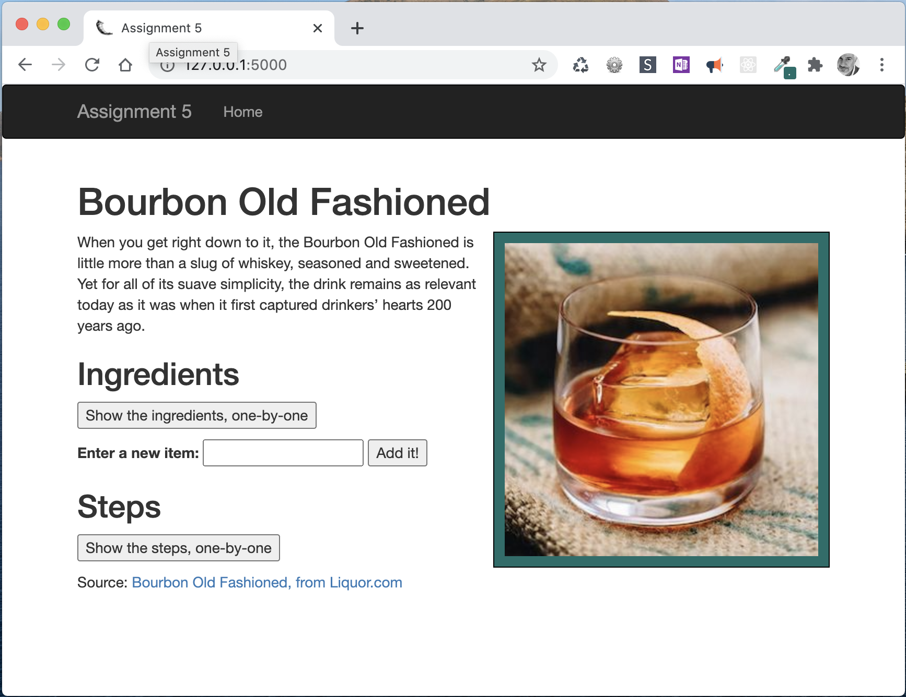
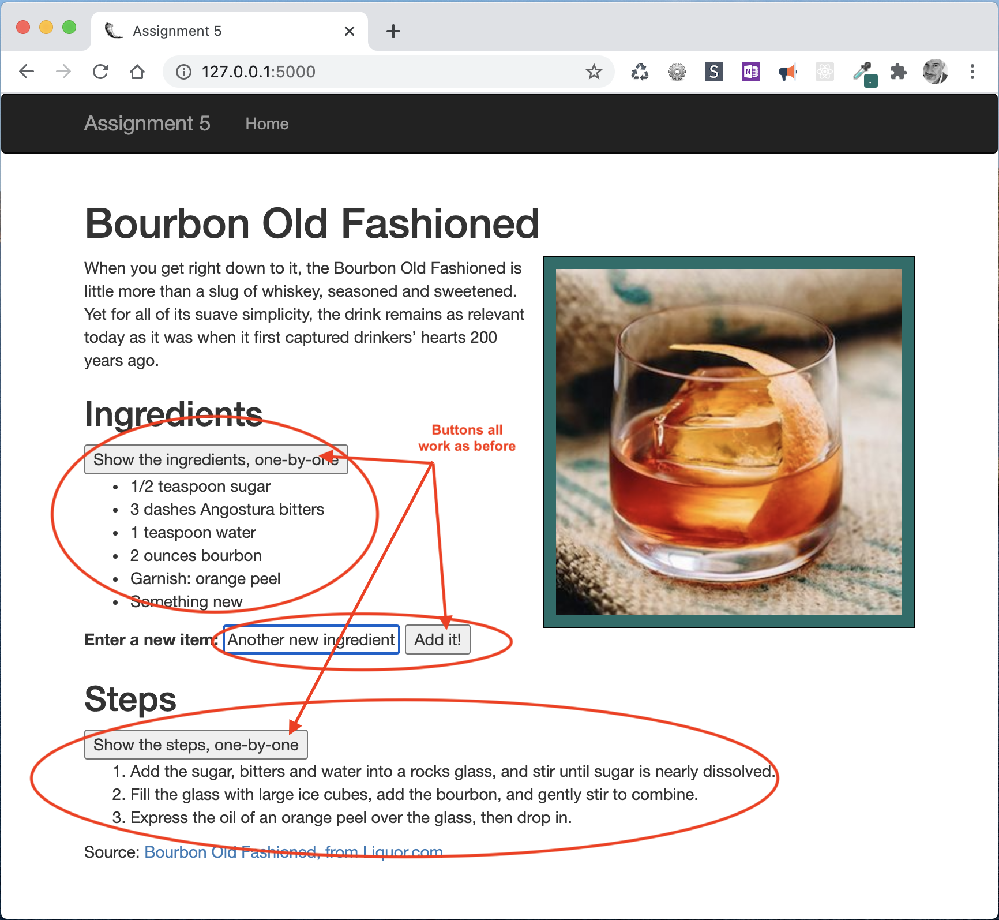

# Assignment 5: HTML Templates

*Due: Thursday, October 1, 2020 (extra time!)* 

Your assignment is to create a new web application based on your Assignment 4 content that demonstrates data, being passed-in from a URL to the webpage, using Flask and Jinja2.

*Granted, this is not a practical application, but it demonstrates some important concepts while giving you practice working with HTML templates.*

## The Goal

Instead of manually creating HTML, CSS, and JavaScript (plus jQuery), you need to do the following:

- Integrate the content into **a Flask app**
- Let **Bootstrap** do (at least) some of the styling
- Add data to the webpage using a **Query String** in the URL

### Other Requirements

- You must use at least **two Jinja2 HTML templates** in the correct filing structure (in "templates")
  - A "base" file, for the general HTML structure
  - A content file (you can call it "index")
- You must use Flask's **Bootstrap CSS Framework** for some or all the styling of the webpage
- Your **static** resources: images; JavaScript; and your custom CSS, if any (not counting Bootstrap) must be in a proper filing structure (everything in their own sub-directories under "static")
- The **data from the query string** from the URL must end-up in your "Ingredients List" using properly coded HTML (i.e. a "list item")

#### Display Requirements

- The web page must **display correctly** using your Assignment 4 content, but being styled partially by Bootstrap
  - Exactly how much you let Bootstrap do the formatting vs. your own CSS is up to you; just make sure everything is still readable and usable
  - Example...




###Functionality

- The web page must **function correctly** using the JavaScript and jQuery from Assignment 4
  - Example...




### Data Injection

This is the new part...

- Use a URL like this to inject data into your web app<br> `http://127.0.0.1:5000/?ingredient=booze`
  - The query string must use the key/value format
  - You only need one key/value pair
  - Suggestion: make the key: "ingredient"
- Use Jinja2's control structures to create a new list item (in an `<li>` tag) showing up in the HTML like this
```html
	<ul id="ingredientsList">
	  <li>1/2 teaspoon sugar</li>
	  <li>3 dashes Angostura bitters</li>
	  <li>1 teaspoon water</li>
	  <li>2 ounces bourbon</li>
	  <li>Garnish: orange peel</li>
	  <li>booze</li>
	</ul>
```

**IMPORTANT:**

- The new data from the query string must appear *at the end* of the list
- If there is no data from the query string (i.e. the URL is simply `http://127.0.0.1:5000`) then nothing new should appear in the list

**VERY IMPORTANT:**

- The new list item from the query string will be hidden when the page loads, along with the rest of the list items!
- NOTE: you need to understand why this is so!  If you understand, you'll be able to answer this question...

## Required: Answer this question

When you insert data into the HTML using Flask and Jinja2, the data appears hidden along with the other list items.  This will always be the case. 

> **THE QUESTION IS: why can't you have JavaScript hide the list first, and *then* have the new list item from the query string appear in the list?**

You must answer the question in the *Write Submission* box in Blackboard when you turn-in your assignment files.

### Bonus Points

Technically, it is possible to have the new list item appear in the list when the page loads.  It's a convoluted set of steps, but if you can figure it out, you'll get 50 extra points which will count towards your overall all grade for assignments

If you have a solution, implement it in your files, and then describe the solution in the *Write Submission* box.

## Turn-in Your Work

You will not be installing this app on our class web server.  You need to ZIP (compress) your **assignment05** folder and turn it in on Blackboard

- In our CSC 210 section in Blackboard, in **Assignment 5: HTML Templates** , upload your ZIP file and write your answer to the question in the "Write Submission" box