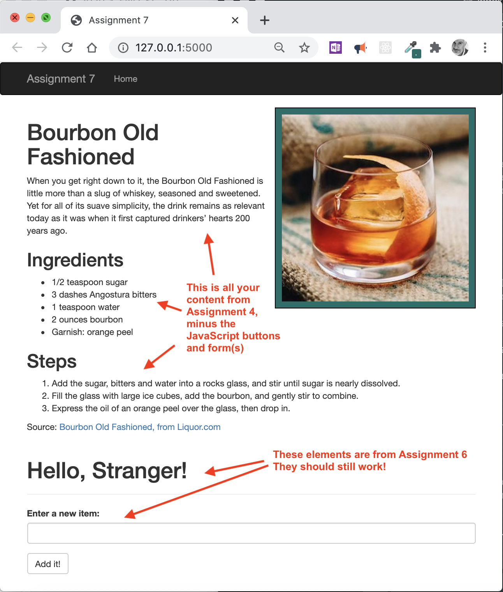
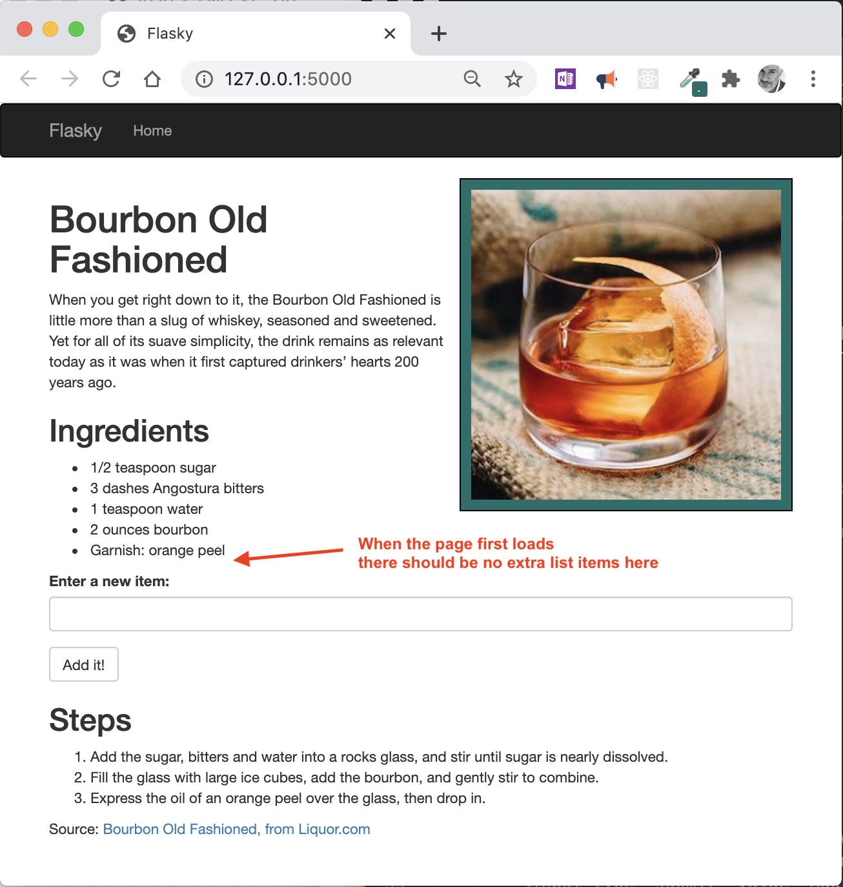
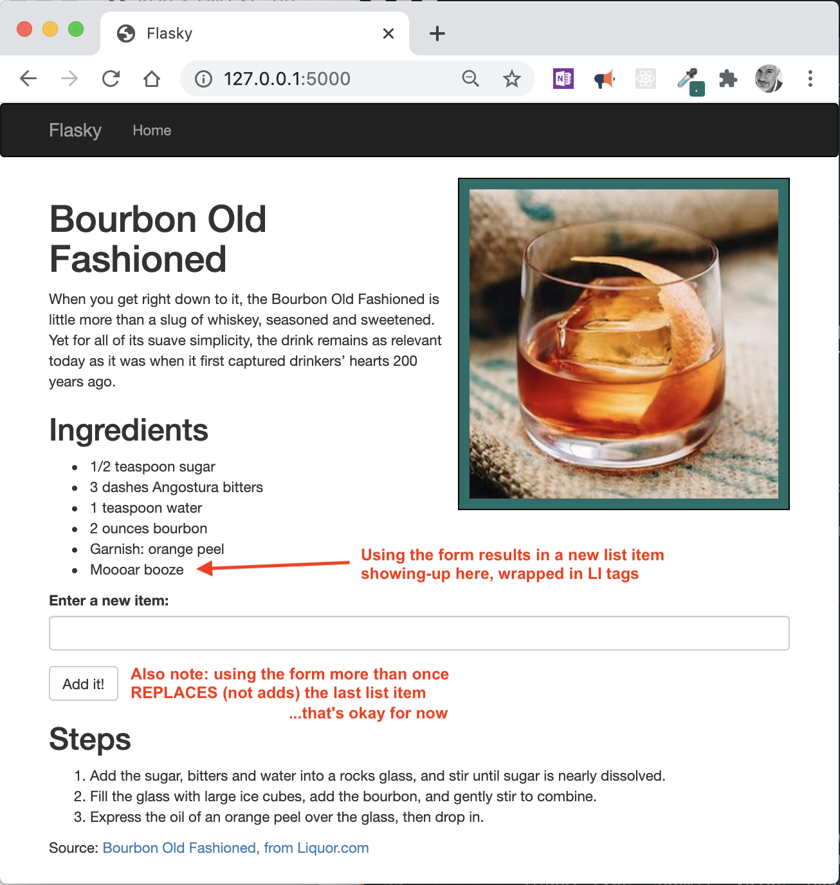

# Assignment 7: Flask HTML Forms

*Due: Tuesday, October 6, 2020*

Your assignment is to create a new web application based on your Assignment 4 content that demonstrates data, being passed-in from an HTML form to the webpage using Flask.

*Granted, this is not a practical application, but this will take us one step closer to storing user-entered data in a database.*

## The Goal

Let the user enter text in an HTML form (generated by Flask) to add a list item to the ingredients list

Note there is a difference between the new functionality and the JavaScript-powered form from Assignment 4:

- The form we're using (from *checkout 4a*) allows only ONE new list item to be added; if the form is used more than once, it *replaces* the previously entered list item - it does not "append" ...and that's okay for this assignment; we'll change that later

## Recommended Steps

1. Create a copy of your Assignment 6 files (`git checkout 4a` from page 49), call it **assignment07**
   - Make sure you can still run the application (*4a*) in your own localhost 
   - Notice how you enter text in the form and it comes right back in the HTML? That should look familiar! That's what you did using JavaScript in Assignment 4. But now, instead of that action happening all on the client-side, you're going to use Flask to accomplish the same thing. 
2. Insert your recipe content into **index.html**; make sure the content, styles, and images still work like they did in Assignment 4 (don't worry about the JavaScript - that needs to be ripped-out)
3. NEW! &rarr; remove all the custom JavaScript we wrote back in Assignment 4.  We won't need it for this application going forward; also remove your "Show the..." buttons for your Ingredients and Steps

At this point your application should look something like this, but with your content and styles...

4. Figure out how to use Flask WTF to accomplish the same thing our JavaScript used to do &rarr; when the user clicks the button, it inserts a new item into our ingredients list

Fulfill the following requirements...

### Requirements

- The old JavaScript and JS-powered elements in the HTML (the buttons and the forms) need to be removed from your webpage
- The Flask-powered HTML form needs to add a list item to the ingredients list
  - Note: if you previously had two HTML forms on this web page, you don't need to replicate that in this assignment; you only need one form - for the ingredients list only

- The Flask-powered HTML form needs to be located on your webpage in roughly the same place as your JavaScript-powered HTML form, using the same label and button text
  - It's okay if it looks different; it'll be totally styled by Bootstrap; you can override the Bootstrap styles to make it match your own styles, but that's not required
- In the controller code (in the .py file) and in the Jinja placeholders, the variable names refer to "name" which doesn't make sense for how we're using it in *this* webpage; you need to change the names from "name" to something that makes sense - something that describes the content we're using (hint: *ingredient*!)
  - Edit the controller code in the .py file and the placeholder code in the HTML accordingly
- Before the user uses the Flask-powered form (when the web page first loads) there should be *no* extra list item in the Ingredients list, i.e. no extra *meatball*/bullet in the list; only AFTER the user uses the Flask-powered form should a new list item appear, and it should be properly coded, appearing at the end of the list and wrapped in an LI tag

*Here is what the webpage should look like when it first loads (with your content and styles of course)...* 

*Here is what the webpage should look like AFTER the user uses the form...* 

## Turn-in Your Work

You are required to install your Assignment 7 app on the Web AND turn-in your ZIP'd files via Blackboard

- Install Assignment 7 on your **UR Digital Scholar** website
  - NEW: if you want to use a different method to publish your app on the web - like use **Heroku** - then do so!  So long as your app is publicly accessible from a standard URL, that's okay.
- In our CSC 210 section in Blackboard, in **Assignment 7: Flask HTML Forms** , 
  - In the "Write Submission" box, paste the URL to your app on the Web
  - Upload a ZIP file containing your Assignment 7 files
