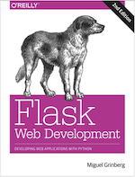

# Course Syllabus: Web Programming

The World Wide Web was born around 1990, so it is not much older than most of you. In this course, we will follow the growth of the Web from its toddler years, to early childhood, to its turbulent pre-teen and teenage years, and finally as it begins to mature as a young adult. Along this journey, you will learn influential Web technologies such as HTTP, HTML, JavaScript, CSS, the LAMP stack, XML, JSON, Ajax, WebSockets, and modern MVC frameworks. Even though you will be doing a lot of programming in this course, its purpose is not to teach you to become an expert in any particular language or framework. Web technologies change at a blistering pace, so specifics quickly get outdated. However, once you take this course and understand the fundamentals, you will be able to easily pick up new technologies on the fly. 

## Course Section: **CSC 210-1 - Web Programming**

- Meeting Pattern: **Tues/Thurs 3:25 PM - 4:40 PM EDT**
- Credits: **4.0**
- No audits will be allowed for this course. 
- Prerequisites: CSC 172

*The course will be 100% online with some synchronous parts, and some asynchronous parts*

- Location: **Live Online Meetings (synchronous, Zoom + recordings in Panopto)**
  - As scheduled, students must attend meetings via Zoom to work on selected assignments with TAs in real-time
  - OR if unable to attend in real-time, watch recordings of the Zoom session in Panopto within 24 hours of being published on Tuesdays and Thursdays
- Location: **Online Lecture (asynchronous, Panopto)**
  - As scheduled, students must watch recorded lecture videos in Panopto within 24 hours of being published on Tuesdays and Thursdays

## Course Information and Announcements

- All **course documentation** and **assignments** for CSC 210 will be published here: **[docs.csc210.org](http://docs.csc210.org/)**, not in Blackboard.
- All **announcements** for CSC 210 will be distributed via "Slack" - an online communication and collaboration tool, not in Blackboard.

  - Students are required to **create a Slack account here**: [ join.slack.com/t/urcsc210/signup](https://join.slack.com/t/urcsc210/signup) and then monitor the CSC 210 Slack Workspace here: **[urcsc210.slack.com](https://urcsc210.slack.com/)** throughout the semester.
    - When registering for an account in Slack, students must use their **rochester.edu** email
    - Suggestion: after you setup your Slack account, instead of using Slack via the website, **install the device software**: [slack.com/downloads](https://slack.com/downloads)
- **Blackboard** will be used for students to turn-in assignments and monitor their grade progress throughout the semester.

## Instructor Information 

- Instructor: **Professor Kostin** Instructional Faculty Digital Media Studies Program; Computer Science Department University of Rochester 206a Morey Hall (private office); 2105 Wegmans Hall (shared office)
- **Messaging**​
  - e-mail: **<robert.kostin@rochester.edu>** - not recommended due to excessive incoming messages, instead...
  - For faster reply, please use [**Slack**](https://urcsc210.slack.com/) to contact the professor; send a **DM to Professor Kostin**
  - For real-time discussions (**office hours**), schedule an appointment using [**Calendly**, an online scheduling app](https://calendly.com/rkostin) to setup a private Zoom meeting

### Teaching Assistants

The following TAs will be online to present assignments, provide suggestions, and answer questions via our **#help channel in Slack**, and via scheduled **Zoom** sessions.

- To learn about **assignments**, attend the scheduled Zoom sessions
- To get **technical help** in Slack, use the #help channel; the TAs will answer
- To discuss **grades or private matters**, search for the TAs by name and send a DM

|  Joshua Choi         |  Junis Ekmekciu  |  Desmond Lai        |
| ------------------------------------------------------------ | ------------------------------------------------------------ | ----------------------------------------------------------- |
|  **Marco Scarlata** |  **Vishad Pokharel** |  **Evan Pollack** |

## Textbook

Textbook (required) **Flask Web Development: Developing Web Applications with Python**, 2nd Edition, ISBN: **9781491991732**

Additional reading and videos will be posted as needed

## Grading

For each assignment, a grading rubric will be provided. Rubrics will inform students how assignments are evaluated.  In the interest of fairness, extra credit and make-up work is not offered.  

### Grading Schema

| **Range**      | **Grade** |
| -------------- | --------- |
| 93.00 to 100   | A         |
| 90.00 to 92.99 | A-        |
| 87.00 to 89.99 | B+        |
| 84.00 to 86.99 | B         |
| 80.00 to 83.99 | B-        |
| 77.00 to 79.99 | C+        |
| 74.00 to 76.99 | C         |
| 70.00 to 73.99 | C-        |
| 67.00 to 69.99 | D+        |
| 64.00 to 66.99 | D         |
| 60.00 to 63.99 | D-        |
| 00.00 to 59.99 | E         |

| Activity             | Weight of the final grade |
| -------------------- | ------------------------- |
| **Lab Assignments**  | 35%                       |
| **Quizzes (online)** | 15%                       |
| **Group Project**    | 50%                       |

## Late assignments

Homework assignments handed in after the deadline without appropriate excuse will receive reduced credit. The maximum possible score on late homework will decrease by 10% for each day late. 

- For example, an assignment which would receive a grade of 85% if handed in on time, would receive a grade of 85% x 90% = 76.5%
- If handed in the next day. The same assignment turned in three days late would receive a grade of 85% x 70% = 59.5%. 
- Following this system, homework handed in 10 or more days late cannot receive a grade higher than 0% and therefore will not be graded. 
- Exceptions to this policy may be made by the TA at the TA's discretion, in response to extenuating circumstances

## Academic Honesty

All assignments and activities associated with this course must be performed in accordance with the [University of Rochester's Academic Honesty Policy](http://www.rochester.edu/college/honesty/). 

You may discuss homework problems with others, but you must not retain written (or photographed) notes from your conversations with other students, or share data via computer files to be used in completing your homework. Your homework must be completed without reference to such notes, with the exception of class and recitation notes, which may be retained in written form. This rule also applies to collaboration between different groups for your group projects. This rule is in place to ensure that you have learned and understand the material based on your discussion and are not simply copying what you were told at critical points in your assignments.

## Attendance

Class attendance and participation is expected. Attendance is not taken and you will notice that there is no attendance component to your grade. However, students that skip lectures will likely have a much more difficult time with quizzes, homework, and the group project. 

##Incompletes

This course follows the [university policy](https://www.rochester.edu/college/ccas/handbook/incompletes.html) regarding incompletes. Incompletes may be given only when there are circumstances beyond the student's control, such as illness or personal emergency, that prevented the student from finishing the coursework on time.

## Absence Due to Illness

The University Health Service does not provide retroactive excuses for missed classes. However, upon request, UHS can provide documentation that the student (you) are (present tense) too ill to attend classes within a certain range of dates, without mention of specifics or the reason for the absence.  

Upon presenting the documentation to the professor, deadlines for assignments may be extended.

Students with extended or severe illness should contact the [College Center for Advising Services](http://www.rochester.edu/college/ccas/) for advice and assistance.

## Academic Support Services

- [College Center for Advising Services](http://www.rochester.edu/college/ccas/)
- [Office of Disability Resources](https://www.rochester.edu/college/disability/) *
- [Center for Excellence in Teaching and Learning (CETL)](https://www.rochester.edu/college/cetl/)
- [Writing, Speaking, and Argument Program](https://writing.rochester.edu/)

*** Disability Resources:** The University of Rochester respects and welcomes students of all backgrounds and abilities. In the event that you encounter any barrier(s) to full participation in this course due to the impact of disability, please contact the **Office of Disability Resources** at [disability@rochester.edu](mailto:disability@rochester.edu); (585) 276-5075; Taylor Hall.

## Schedule

This [schedule (linked here)](schedule.md) is subject to modification throughout the semester.  Always check with the professor to answer questions about the schedule.